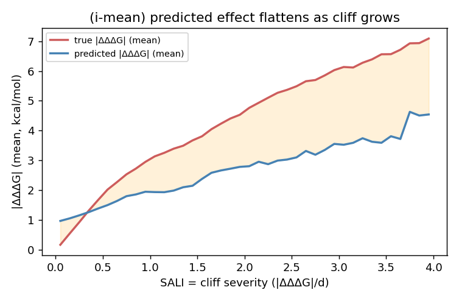
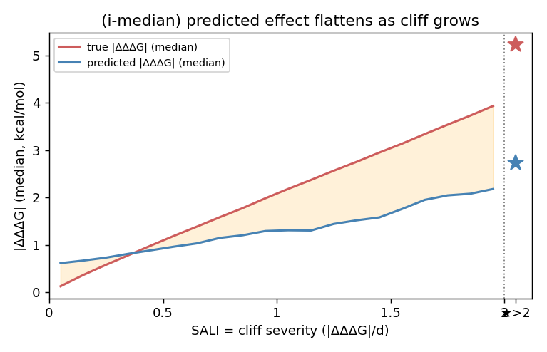
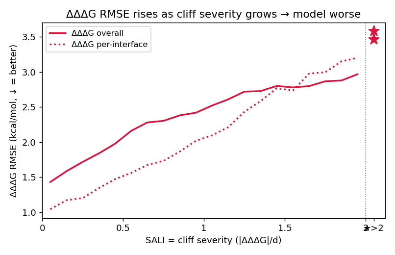
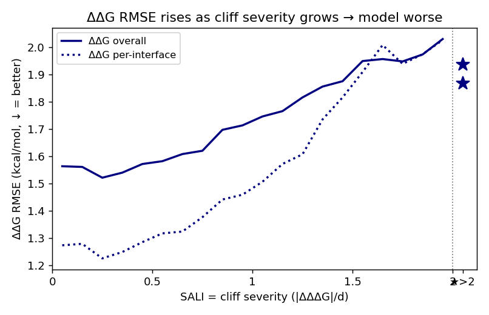

# Mutation Cliff: SKEMPIv2 上的数据分析与 ADiT 失效证据(Research Motivation 草稿)

> 一句话: **在 SKEMPIv2 上,"近乎相同的突变 → ΔΔG 巨变"(mutation cliff)真实且普遍存在**(以 cliff 指数
> `SALI = |ΔΔΔG|/d` 度量: **6.3% 的突变对每突变步跳变 >2 kcal/mol**);**而 cliff 越严重,ADiT 越差——预测 effect
> 被系统性"抹平"(SALI>2 时真值 effect ~5.6、预测压在 ~3.3),RMSE 随 cliff 单调放大(ΔΔG per-interface 1.27→1.87)**。
> 注意: Pearson/Spearman 在 cliff 区反而升高(SNR 假象),会掩盖这一失效;聚合 overall Pearson 0.66 同样掩盖。

## 1. 背景与定义
化学信息学里的 **activity cliff**: 结构高度相似的分子活性却差异巨大,是 QSAR/打分模型的已知失效点。
迁移到 **蛋白突变效应(ΔΔG)** 任务:

> **Mutation cliff** = 同一复合物界面上、mutant 序列高度相似(尤其同一位点仅替换氨基酸、或仅差一个突变步)
> 但实验 ΔΔG 差异巨大的一对/一组突变。

## 2. 数据与方法
- 数据: SKEMPIv2,ADiT-S 三折交叉验证的**逐样本池化预测**(`reproduce/skempi_per_sample_pred.csv`,6694 样本)。
- **突变距离 d**: 两条 mutant 序列**逐点比对、取值不同的位点数**(等价 Hamming 距离;只在两者突变位点并集上比即可,
  其余位点同为 WT)。同位点不同 AA → d=1;不同位点 → d≥2;相同 mutant 已去重故无 d=0。
- **cliff 指数 SALI** = `|ΔΔΔG| / d`(每突变步引起的 ΔΔG 变化,越大越陡)。**这是刻画 cliff 的核心指标**:
  big ΔΔG 若跨很多突变步(大 d)不稀奇,跨一步(小 d)才是"悬崖"。
- **配对集合(§3 SALI、§4 跳变分析共用)**: 每个 complex 内 distinct mutant(同突变集合的重复测量先取均值)
  两两任意配对(distinct mutant >250 的大 complex 做 **CAP=250 随机采样**,seed=0),pool 全部 341 个 complex
  共 **270,608 对**。
- **site-matched 噪声基线(§3)**: 在同一批 cliff 位点上,用"同位点·同一个 AA 的重复测量"的 ΔΔG 离散度作噪声基线
  (而非全数据任意重复),排除"这些位点本身难测"的替代解释。
- **重复测量如何进训练/测试**: SKEMPI 同一突变的多次测量**各作为独立样本保留**(标签=各自原始实验值),**非取 median**;
  池化口径与 RDE/DiffAffinity/ADiT 一致;实测对 overall 指标无实质影响(去重后 Pearson 0.664 vs 池化 0.662)、且
  split-by-complex 下重复样本恒在同折、无泄漏。
- 脚本: `mutation_cliff_analysis.py`(单点/同位点)、`mutation_cliff_extended.py`(配对/SALI 基础版)、
  `mutation_cliff_viz.py`(§3/§4 的分布图与 ADiT 失效分析,产物在 `mutation_analysis/`)。

## 3. 发现 1: Mutation cliff 真实存在
对全部 270,608 个突变对,从分布形状、尾部、与相似度的关系三个角度看 cliff 指数 **SALI = |ΔΔΔG|/d**。

**Evidence 1 — SALI 的 ECDF: 每突变步的大跳变占比可观,且最相似(d=1)处最陡**
<table><tr>
<td></td>
<td></td>
</tr></table>

- 全体对: SALI median 0.44,但 **6.3% 的对 SALI>2**(每突变步跳 >2 kcal/mol)、p99 **3.29**、max **12.9**——重尾。
- 分 d: **d=1 的尾部最重**(SALI>2 占 **21.7%**,ECDF 在 x=2 处只到 ~0.78);**单步替换正是最陡的悬崖**。

**Evidence 2 — 排序后 100 等量分位的均值曲线: cliff 是尾部事件**
<table><tr>
<td></td>
<td></td>
</tr></table>

- 把 SALI 从小到大排序、均分 100 桶取均值: 前 ~90 个分位平缓(<1.6),**末 ~6 个分位骤升到 3–13**——
  典型重尾,**陡峭 cliff 是少数尾部事件而非整体平移**。
- 分 d: d=1 曲线整体最高(单步最陡),高 d 因除以大 d 而整体下移。

**Evidence 3 — 各 d 的 SALI 点云 + 统计**

| d | n | median | 离散系数 CV | p90 | p99 | max | 平滑<0.5 | 悬崖>2 |
|---|---|---|---|---|---|---|---|---|
| 1 | 9,225 | **0.885** | **1.08** | 3.15 | 6.87 | 12.9 | 32.8% | **21.7%** |
| 2 | 147,323 | 0.444 | 1.06 | 1.82 | 3.41 | 5.52 | 53.6% | 8.1% |
| 3 | 36,662 | 0.669 | 0.81 | 1.73 | 2.74 | 4.38 | 40.4% | 5.9% |
| 4 | 22,022 | 0.466 | 0.90 | 1.47 | 2.41 | 3.19 | 52.6% | 3.9% |
| 5 | 14,724 | 0.404 | 0.83 | 1.10 | 1.77 | 2.54 | 59.4% | 0.2% |
| **all** | **270,608** | **0.440** | **1.07** | **1.65** | **3.29** | **12.9** | **54.2%** | **6.3%** |

- **最相似(d=1)处 SALI 最高**: median 0.885、**21.7% 的对每步跳 >2**——相似度越高,单步悬崖越突出。
- **固定 d 内 SALI 高度分散**: 各 d 的 CV ≈ 0.8–1.08(>0.8),**相似突变里 SALI 既有近 0、又有 >2 的尾部**,分布不集中。
- **相似度与 SALI 弱(负)相关**: `corr(d, SALI)` Pearson **−0.21** / Spearman **−0.13**——距离越大 SALI 越小(被 d 归一),
  但**单步(d=1)反而最陡**,印证 cliff 集中在"最相似"邻域。

## 4. 发现 2: 随着 mutation cliff 程度增加,ADiT 的预测越来越差
- **预测幅度压缩**: 同位点内真值 ΔΔG range median 0.91,模型预测 range 仅 0.67。
- **跳变低估(同位点突变对,7933 对)**: 真值跳变 vs 预测跳变 Pearson 0.57 / Spearman 0.50;cliff 对(|ΔΔΔG真|>2,
  1745 对)模型只预测出 ~0.47 倍幅度,真实大跳变里仅 40% 被判为大跳变(>3 时仅 33%)。
- **同位点排序失效(k≥3,133 组)**: 组内 Spearman median 0.50、**mean 仅 0.37、21% 为负**。

### 4.1 随着 mutation cliff 程度增加,模型效果逐渐下降
按 cliff 指数 SALI 分桶: **[0,2) 按 step=0.1 细分(20 桶)+ 一个 >2 聚合点(图中 ★)**;图与下方明细表同为 0.1 粒度。

**(i) 幅度 flatten: 真值 effect 一路爬升,预测 effect 跟不上**
<table><tr>
<td></td>
<td></td>
</tr></table>

| SALI 桶 | 0–.1 | .1–.2 | .2–.3 | .3–.4 | .4–.5 | .5–.6 | .6–.7 | .7–.8 | .8–.9 | .9–1 | 1–1.1 | 1.1–1.2 | 1.2–1.3 | 1.3–1.4 | 1.4–1.5 | 1.5–1.6 | 1.6–1.7 | 1.7–1.8 | 1.8–1.9 | 1.9–2 | >2 |
|---|---|---|---|---|---|---|---|---|---|---|---|---|---|---|---|---|---|---|---|---|---|
| n | 41673 | 33636 | 28678 | 23256 | 19457 | 16476 | 13741 | 11648 | 9856 | 8930 | 7760 | 6719 | 5943 | 5310 | 4735 | 4045 | 3587 | 3036 | 2697 | 2436 | 16989 |
| 真值 mean | 0.18 | 0.56 | 0.93 | 1.32 | 1.68 | 2.03 | 2.28 | 2.54 | 2.73 | 2.95 | 3.14 | 3.26 | 3.40 | 3.50 | 3.67 | 3.81 | 4.05 | 4.23 | 4.41 | 4.53 | 5.59 |
| 预测 mean | 0.98 | 1.06 | 1.16 | 1.27 | 1.39 | 1.51 | 1.64 | 1.81 | 1.86 | 1.95 | 1.94 | 1.94 | 1.99 | 2.10 | 2.15 | 2.38 | 2.59 | 2.67 | 2.73 | 2.79 | 3.26 |
| 真值 median | 0.12 | 0.36 | 0.58 | 0.79 | 0.99 | 1.19 | 1.39 | 1.59 | 1.78 | 1.99 | 2.18 | 2.37 | 2.57 | 2.75 | 2.95 | 3.14 | 3.34 | 3.54 | 3.73 | 3.94 | 5.22 |
| 预测 median | 0.61 | 0.67 | 0.73 | 0.81 | 0.89 | 0.96 | 1.03 | 1.15 | 1.20 | 1.29 | 1.31 | 1.30 | 1.44 | 1.52 | 1.58 | 1.76 | 1.95 | 2.05 | 2.08 | 2.18 | 2.72 |

**(ii) RMSE 随 cliff 严重度单调上升 = 模型越来越差**
对每个 SALI 桶算 ΔΔΔG / ΔΔG 的 **overall 与 per-interface RMSE**(per-interface = 每个 complex 内 ≥10 样本算 RMSE 再求均值),
合并到一张图。(**Pearson/Spearman 已弃用**: 它们随 cliff 反而上升——cliff 桶里 target 绝对值跨度大、SNR 高,相关系数被
天然抬高,是假象,无法反映 cliff 上的退化。)

<table><tr>
<td></td>
<td></td>
</tr></table>

| SALI 桶 | 0–.1 | .1–.2 | .2–.3 | .3–.4 | .4–.5 | .5–.6 | .6–.7 | .7–.8 | .8–.9 | .9–1 | 1–1.1 | 1.1–1.2 | 1.2–1.3 | 1.3–1.4 | 1.4–1.5 | 1.5–1.6 | 1.6–1.7 | 1.7–1.8 | 1.8–1.9 | 1.9–2 | >2 |
|---|---|---|---|---|---|---|---|---|---|---|---|---|---|---|---|---|---|---|---|---|---|
| ΔΔΔG overall | 1.43 | 1.58 | 1.72 | 1.84 | 1.98 | 2.16 | 2.28 | 2.30 | 2.38 | 2.42 | 2.52 | 2.61 | 2.72 | 2.73 | 2.80 | 2.78 | 2.80 | 2.87 | 2.88 | 2.97 | 3.46 |
| ΔΔΔG per-interface | 1.04 | 1.17 | 1.20 | 1.34 | 1.47 | 1.56 | 1.67 | 1.73 | 1.86 | 2.02 | 2.10 | 2.21 | 2.43 | 2.58 | 2.77 | 2.73 | 2.98 | 3.00 | 3.15 | 3.20 | 3.57 |
| ΔΔG overall | 1.56 | 1.56 | 1.52 | 1.54 | 1.57 | 1.58 | 1.61 | 1.62 | 1.70 | 1.71 | 1.75 | 1.77 | 1.82 | 1.86 | 1.88 | 1.95 | 1.96 | 1.95 | 1.97 | 2.03 | 1.94 |
| ΔΔG per-interface | 1.27 | 1.28 | 1.22 | 1.25 | 1.28 | 1.32 | 1.32 | 1.38 | 1.44 | 1.46 | 1.51 | 1.57 | 1.61 | 1.74 | 1.82 | 1.91 | 2.01 | 1.94 | 1.98 | 2.03 | 1.87 |

**结论**: 四条 RMSE 曲线**全部随 cliff 严重度单调上升**(ΔΔΔG-overall 1.43→3.46、ΔΔΔG-perif 1.04→3.57、
ΔΔG-overall 1.56→1.94、ΔΔG-perif 1.27→1.87)——**cliff 越严重,模型预测越差**。配合 (i) 的幅度 flatten,
**ADiT 在 cliff 区把 effect 系统性压扁、绝对误差随之放大**,这就是 cliff 失效的本质。

### 4.2 极端 case 展示
从 **d=1(同位点换一个 AA)** 的对里挑出两类典型 case: **正常**(两 AA 真值 ddG 差小、且模型预测跳变贴近真值跳变)
与**不正常**(真值 ddG 差大 = cliff、且预测跳变与真值跳变差很大)。完整表见 `mutation_analysis/sali_pairs_table.csv`。

**正常 5 例(模型表现好): 真值跳变小,预测跳变贴合**
| PDB | 位点 | 突变 A | 突变 B | ddG_A | ddG_B | 真值跳变 | 预测跳变 |
|---|---|---|---|---|---|---|---|
| 1A22_A_B | A164 | T→A | T→S | 1.91 | 1.69 | +0.22 | +0.41 |
| 1AK4_A_D | D91 | I→V | I→A | 0.00 | 0.24 | −0.24 | −0.38 |
| 1AO7_ABC_DE | D28 | G→L | G→M | −0.47 | −0.52 | +0.05 | +0.20 |
| 1B41_A_B | B47 | N→R | N→W | −0.03 | 0.04 | −0.07 | −0.34 |
| 1BRS_A_D | A71 | E→C | E→Y | 2.53 | 2.41 | +0.12 | −0.18 |

**不正常 5 例(模型失效): 真值跳变大(cliff),预测跳变严重失配**
| PDB | 位点 | 突变 A | 突变 B | ddG_A | ddG_B | 真值跳变 | 预测跳变 |
|---|---|---|---|---|---|---|---|
| 1PPF_E_I | I18 | L→I | L→W | −0.73 | 7.54 | **−8.28** | **+5.76** |
| 1CHO_EFG_I | I15 | L→A | L→W | 4.85 | −1.69 | **+6.54** | **−2.00** |
| 2JEL_LH_P | P34 | T→N | T→Q | 6.82 | 0.00 | **+6.82** | **−0.17** |
| 1R0R_E_I | I10 | A→E | A→L | 4.58 | −1.76 | **+6.33** | **+0.17** |
| 2FTL_E_I | I15 | K→V | K→S | 11.76 | 7.72 | **+4.03** | **−1.79** |

- **正常组**: 两个相近替换的真值 ddG 本就接近(跳变 <0.3),模型也预测出接近的小跳变——没有 cliff、模型表现正常。
- **不正常组**: 同一位点换个 AA,真值 ddG 却差 4–8 kcal/mol(典型 cliff),而模型预测的跳变要么被压扁到接近 0、要么方向判反——**完全没抓住 cliff**。这些位点都是**蛋白酶-抑制剂的 P1 类热点**(1PPF/I18、1CHO/I15、1R0R/I10、2FTL/I15、2JEL/P34)。

## 5. 产物
- 数据: `skempi_per_sample_pred.csv`、`skempi_mutation_cliff_pairs.csv`、`skempi_same_site_groups.csv`、
  `skempi_cliff_pairs_SALI_top2000.csv`;**全配对表 `mutation_analysis/sali_pairs_table.csv`(270,608 行)**。
- 图(`mutation_analysis/`): `ecdf_sali_combined.png`/`ecdf_sali_by_d.png`(Evidence 1)、`qmean_sali_combined.png`/`qmean_sali_by_d.png`(Evidence 2)、`pointcloud_sali_by_d.png`(Evidence 3)、`adit_cliff_flatten_mean.png`/`adit_cliff_flatten_median.png`(§4.1-i)、`adit_cliff_rmse_dddg.png`/`adit_cliff_rmse_ddg.png`(§4.1-ii)。
- 图(根目录,早期版本/旁证): `fig_cliff_vs_noise.png`、`fig_jump_true_vs_pred.png`、`fig_jump_saturation.png`、`fig_absT_by_distance.png`。
- 脚本: `mutation_cliff_analysis.py`、`mutation_cliff_extended.py`、`mutation_cliff_viz.py`。

## 6. 证伪记录: "cliff 越严重 → 排序/二分类表现越差"——多角度尝试均失败
**背景**: mutation effect prediction 的主评测是 **affinity ranking**,所以我们曾想证明假设
**H: 「随 mutation cliff 程度加重,模型的(细粒度)ranking / 排序能力逐渐下降」**。从 6 个角度测试,**全部证伪**:
排序/符号类指标在 cliff 上**不降反升**。本节如实记录全部尝试与数据,供后续避免重复走弯路。

**统一的二分类指标定义(贯穿尝试 1–5)**: 同一 complex 内无序 mutant 对 (A,B),`dT=ddG_A−ddG_B`(真值差)、
`dP=pred_A−pred_B`(预测差)、`d`=突变距离、`SALI=|dT|/d`。只评估 `|dT|≥τ` 的"真值可区分对"。
- **INVERTED(判反)**: `sign(dP)≠sign(dT)` 且 `|dP|≥ε`
- **INDISTINCT(分不开)**: `|dP|<ε`(预测基本一致)
- **Inversion rate** = INVERTED 占比;**Ordering-failure rate** = (INVERTED+INDISTINCT) 占比。

### 尝试 1 — marginal: 按 SALI 分桶,τ×ε 全网格(30 配置)
对 `τ∈{0.1,0.2,0.3,0.4,0.5,1.0} × ε∈{0.1,0.2,0.3,0.4,0.5}` 共 30 配置,逐一算 failure rate 随 SALI 的走向。

| 配置 | 0–.5 | .5–1 | 1–1.5 | 1.5–2 | >2 | trend(末−首) |
|---|---|---|---|---|---|---|
| τ=0.1, ε=0.1 | 44.9 | 28.9 | 20.3 | 14.6 | 11.3 | −33.6 |
| τ=0.1, ε=0.5 | 60.3 | 41.3 | 30.2 | 21.9 | 16.3 | −44.1 |
| τ=0.5, ε=0.1 | 40.8 | 28.9 | 20.3 | 14.6 | 11.3 | −29.5 |
| τ=0.5, ε=0.5 | 53.7 | 41.3 | 30.2 | 21.9 | 16.3 | −37.5 |
| τ=1.0, ε=0.1 | 35.4 | 28.5 | 20.3 | 14.6 | 11.3 | −24.1 |
| τ=1.0, ε=0.5 | 44.1 | 40.5 | 30.2 | 21.9 | 16.3 | −27.8 |

**30/30 配置 trend 全为负(failure 随 cliff 单调下降),无任何单调递增配置。** 增大 τ(0.1→1)只把首桶压低、缩小落差,但**永远翻不过来**。inversion rate 同理(τ=0.5/ε=0.1: 34.3→23.4→15.9→11.7→9.3)。

### 尝试 2 — 控制变量: 固定真值 gap |dT|,按相似度 d
怀疑 (1) 被"高 SALI 桶天然 |dT| 大"混淆,于是固定 |dT| 区间、改变 d(d 越小=越相似=越像 cliff)。inversion%(ε=0.1):

| 固定 \|dT\| | d=1(最像) | d=3 | d=5(最不像) |
|---|---|---|---|
| [1,2) | 25 | 29 | 36 |
| [2,3) | 14 | 17 | 29 |

**固定 gap 时,越相似(d 越小)inversion 反而越低**——与 H 相反(越像 cliff 排得越对)。

### 尝试 3 — 分层: 先按 |dT| 切 cluster,cluster 内再按 SALI 分桶
用户提议的设计,把 gap 摁住后在 cluster 内看 SALI。τ=0.5, ε=0.3,inversion%:

| \|dT\| cluster | SALI 0–.5 | .5–1 | 1–1.5 | 1.5–2 | 2–3 |
|---|---|---|---|---|---|
| [1,2) | 32 | 21 | 19 | 16 | — |
| [2,3) | 26 | 18 | 15 | — | 11 |
| [3,5) | 15 | 15 | 10 | 10 | 10 |
| ≥5 | 15 | 7 | 5 | 6 | 5 |

**每个 cluster 内部,SALI 越高 inversion 越低**——再次与 H 相反。

### 尝试 4 — 只取 d=1(SALI≡|dT|)
| \|dT\|(=SALI) | n | capture | inv%(ε.1/.5) | fail%(ε.1/.5) |
|---|---|---|---|---|
| 0–.5 | 3029 | 2.96 | 43/22 | 56/77 |
| 1–1.5 | 1271 | 0.78 | 26/13 | 35/53 |
| 2–3 | 998 | 0.57 | 14/8 | 19/34 |
| >3 | 1002 | 0.53 | 12/8 | 16/23 |

inv/fail 随 SALI **下降**(43%→12%);只有 **capture 单调崩塌(2.96→0.53)**。

### 尝试 5 — 最苛刻: single-site & d=1(同位点换 AA,7106 对)
| \|dT\|(=SALI) | n | capture | inv%(ε.1/.5) | fail%(ε.1/.5) |
|---|---|---|---|---|
| 0–.5 | 2274 | 3.10 | 43/23 | 56/76 |
| 1–1.5 | 1006 | 0.79 | 27/14 | 37/53 |
| 2–3 | 760 | 0.60 | 16/9 | 21/34 |
| >3 | 787 | 0.54 | 13/9 | 16/23 |

与尝试 4 同型: 排序类**下降**,capture **崩塌(3.10→0.54)**。

### 尝试 6 — 同位点组内 ranking Spearman vs 真值 range
同位点(同 complex 同 site)、k≥3 个不同 AA 的组(133 组),组内 Spearman(真值 vs 预测)对照组内真值 ddG range(=cliff 严重度;range 越大本应越好排、Spearman 应→1):

| 真值 range | n | within-group Spearman(mean) | <0 占比 | capture(pred_std/true_std) |
|---|---|---|---|---|
| 0–1 | 29 | 0.31 | 34% | 1.54 |
| 1–2 | 36 | 0.13 | 33% | 0.94 |
| 2–3 | 23 | 0.42 | 17% | 0.76 |
| 3–4 | 10 | 0.43 | 10% | 0.70 |
| >4 | 35 | 0.62 | 3% | 0.72 |

整体 within-group Spearman mean 0.37 / median 0.50 / **21% 为负**。随 range 增大,Spearman **总体上升**(0.31→0.62),capture **下降**(1.54→0.72)。

### 统一原因(数学必然,非"没调好参数")
**排序/符号是否正确,只取决于真值 gap |dT| 的可分辨性;gap 越大越容易排对。** 而 cliff 的本质就是"真值差大"
(高 SALI;或固定 gap 时小 d 把效应集中到一个清晰的单点突变)——**所以"越像 cliff"恒等于"真值差越清晰",
排序只会更容易,绝不可能随 cliff 严重度变差**。这与 Pearson/Spearman 随 SALI 上升同源,都是 gap 大小的内禀效应。

### 结论
- ❌ **任何基于排序/符号的指标都无法支撑 H**(6 角度全证伪;数学上不可能)。
- ✅ **唯一随 cliff 严重度单调恶化的是「幅度」**: capture↓(同位点 1.5→0.5)、RMSE↑(见 §4.1)、effect 被压扁。
- 🔎 **诚实推论**: cliff 对 **ranking 口径的 effect prediction 影响很小**(cliff 甚至是 ranking 里最容易的部分);
  模型的 ranking 短板是**通用上限**(per-interface ~0.33、同位点 ~0.37),与 cliff 严重度无单调关系。
  cliff 真正咬得动的是 **magnitude / calibration**(绝对 ddG、阈值/工程任务),应把 motivation 定位到该轴,而非 ranking。
