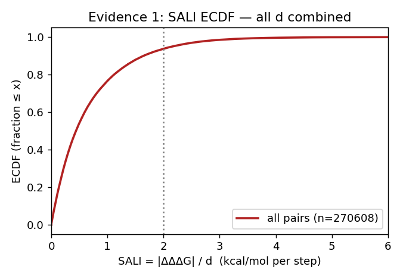
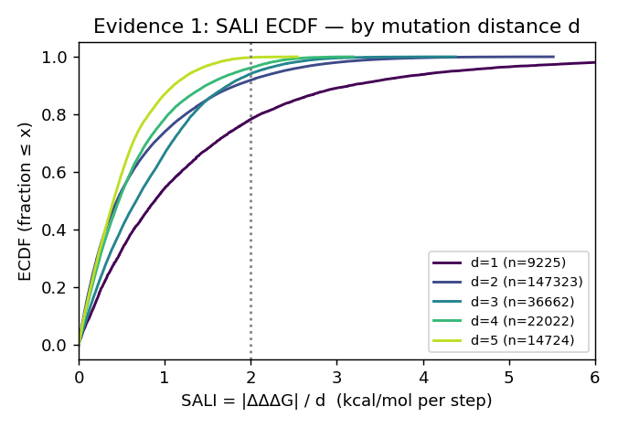
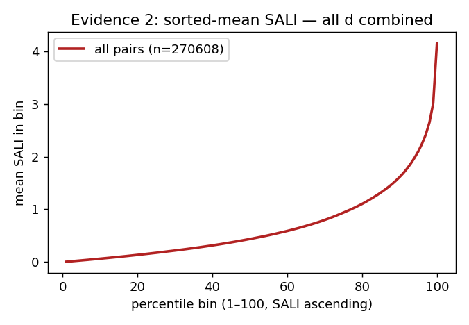
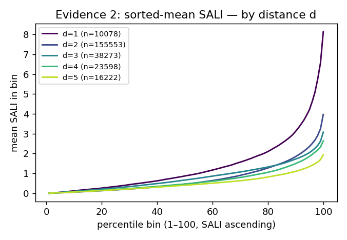
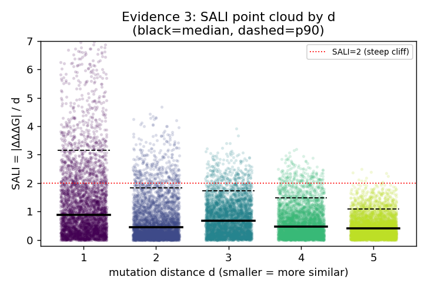
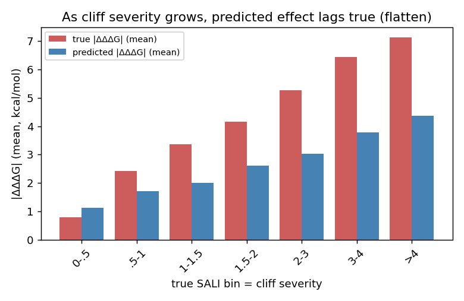
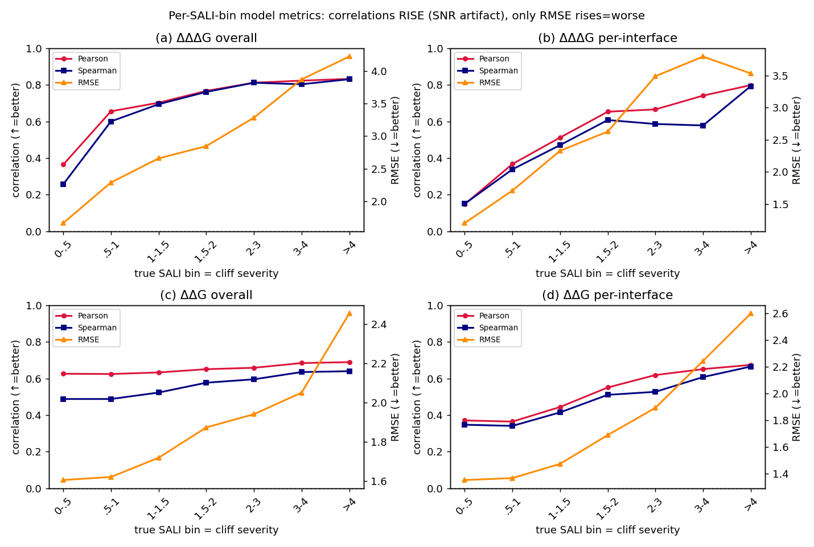

# Mutation Cliff:SKEMPIv2 上的数据分析与 ADiT 失效证据(Research Motivation 草稿)

> 一句话:**在 SKEMPIv2 上,"近乎相同的突变 → ΔΔG 巨变"(mutation cliff)真实且普遍存在**(以 cliff 指数
> `SALI = |ΔΔΔG|/d` 度量:**6.3% 的突变对每突变步跳变 >2 kcal/mol**);**而 cliff 越严重,ADiT 越差——预测 effect
> 被系统性"抹平"(真值爬到 7、预测停在 4.4),RMSE 随 cliff 单调放大(ΔΔG per-interface 1.35→2.60)**。
> 注意:Pearson/Spearman 在 cliff 区反而升高(SNR 假象),会掩盖这一失效;聚合 overall Pearson 0.66 同样掩盖。

## 1. 背景与定义
化学信息学里的 **activity cliff**:结构高度相似的分子活性却差异巨大,是 QSAR/打分模型的已知失效点。
迁移到 **蛋白突变效应(ΔΔG)** 任务:

> **Mutation cliff** = 同一复合物界面上、mutant 序列高度相似(尤其同一位点仅替换氨基酸、或仅差一个突变步)
> 但实验 ΔΔG 差异巨大的一对/一组突变。

## 2. 数据与方法
- 数据:SKEMPIv2,ADiT-S 三折交叉验证的**逐样本池化预测**(`reproduce/skempi_per_sample_pred.csv`,6694 样本)。
- **突变距离 d**:两条 mutant 序列**逐点比对、取值不同的位点数**(等价 Hamming 距离;只在两者突变位点并集上比即可,
  其余位点同为 WT)。同位点不同 AA → d=1;不同位点 → d≥2;相同 mutant 已去重故无 d=0。
- **cliff 指数 SALI** = `|ΔΔΔG| / d`(每突变步引起的 ΔΔG 变化,越大越陡)。**这是刻画 cliff 的核心指标**:
  big ΔΔG 若跨很多突变步(大 d)不稀奇,跨一步(小 d)才是"悬崖"。
- **配对集合(§3 SALI、§4 跳变分析共用)**:每个 complex 内 distinct mutant(同突变集合的重复测量先取均值)
  两两任意配对(distinct mutant >250 的大 complex 做 **CAP=250 随机采样**,seed=0),pool 全部 341 个 complex
  共 **270,608 对**。
- **site-matched 噪声基线(§3)**:在同一批 cliff 位点上,用"同位点·同一个 AA 的重复测量"的 ΔΔG 离散度作噪声基线
  (而非全数据任意重复),排除"这些位点本身难测"的替代解释。
- **重复测量如何进训练/测试**:SKEMPI 同一突变的多次测量**各作为独立样本保留**(标签=各自原始实验值),**非取 median**;
  池化口径与 RDE/DiffAffinity/ADiT 一致;实测对 overall 指标无实质影响(去重后 Pearson 0.664 vs 池化 0.662)、且
  split-by-complex 下重复样本恒在同折、无泄漏。
- 脚本:`mutation_cliff_analysis.py`(单点/同位点)、`mutation_cliff_extended.py`(配对/SALI 基础版)、
  `mutation_cliff_viz.py`(§3/§4 的分布图与 ADiT 失效分析,产物在 `mutation_analysis/`)。

## 3. 发现 1:Mutation cliff 真实存在
对全部 270,608 个突变对,从分布形状、尾部、与相似度的关系三个角度看 cliff 指数 **SALI = |ΔΔΔG|/d**。

**Evidence 1 — SALI 的 ECDF:每突变步的大跳变占比可观,且最相似(d=1)处最陡**
<table><tr>
<td></td>
<td></td>
</tr></table>

- 全体对:SALI median 0.44,但 **6.3% 的对 SALI>2**(每突变步跳 >2 kcal/mol)、p99 **3.29**、max **12.9**——重尾。
- 分 d:**d=1 的尾部最重**(SALI>2 占 **21.7%**,ECDF 在 x=2 处只到 ~0.78);**单步替换正是最陡的悬崖**。

**Evidence 2 — 排序后 100 等量分位的均值曲线:cliff 是尾部事件**
<table><tr>
<td></td>
<td></td>
</tr></table>

- 把 SALI 从小到大排序、均分 100 桶取均值:前 ~90 个分位平缓(<1.6),**末 ~6 个分位骤升到 3–13**——
  典型重尾,**陡峭 cliff 是少数尾部事件而非整体平移**。
- 分 d:d=1 曲线整体最高(单步最陡),高 d 因除以大 d 而整体下移。

**Evidence 3 — 各 d 的 SALI 点云 + 统计**

| d | n | median | 离散系数 CV | p90 | p99 | max | 平滑<0.5 | 悬崖>2 |
|---|---|---|---|---|---|---|---|---|
| 1 | 9,225 | **0.885** | **1.08** | 3.15 | 6.87 | 12.9 | 32.8% | **21.7%** |
| 2 | 147,323 | 0.444 | 1.06 | 1.82 | 3.41 | 5.52 | 53.6% | 8.1% |
| 3 | 36,662 | 0.669 | 0.81 | 1.73 | 2.74 | 4.38 | 40.4% | 5.9% |
| 4 | 22,022 | 0.466 | 0.90 | 1.47 | 2.41 | 3.19 | 52.6% | 3.9% |
| 5 | 14,724 | 0.404 | 0.83 | 1.10 | 1.77 | 2.54 | 59.4% | 0.2% |
| **all** | **270,608** | **0.440** | **1.07** | **1.65** | **3.29** | **12.9** | **54.2%** | **6.3%** |

- **最相似(d=1)处 SALI 最高**:median 0.885、**21.7% 的对每步跳 >2**——相似度越高,单步悬崖越突出。
- **固定 d 内 SALI 高度分散**:各 d 的 CV ≈ 0.8–1.08(>0.8),**相似突变里 SALI 既有近 0、又有 >2 的尾部**,分布不集中。
- **相似度与 SALI 弱(负)相关**:`corr(d, SALI)` Pearson **−0.21** / Spearman **−0.13**——距离越大 SALI 越小(被 d 归一),
  但**单步(d=1)反而最陡**,印证 cliff 集中在"最相似"邻域。

## 4. 发现 2:随着 mutation cliff 程度增加,ADiT 的预测越来越差
- **预测幅度压缩**:同位点内真值 ΔΔG range median 0.91,模型预测 range 仅 0.67。
- **跳变低估(同位点突变对,7933 对)**:真值跳变 vs 预测跳变 Pearson 0.57 / Spearman 0.50;cliff 对(|ΔΔΔG真|>2,
  1745 对)模型只预测出 ~0.47 倍幅度,真实大跳变里仅 40% 被判为大跳变(>3 时仅 33%)。
- **同位点排序失效(k≥3,133 组)**:组内 Spearman median 0.50、**mean 仅 0.37、21% 为负**。

### 4.1 随着 mutation cliff 程度增加,模型效果逐渐下降
按 cliff 指数 SALI 分桶(0–4 细分 + >4),桶号越大 = cliff 越陡。

**(i) 幅度 flatten:真值 effect 一路爬升,预测 effect 跟不上**

| 真值 SALI 桶(cliff 严重度) | n | 真值 \|ΔΔΔG\| mean | 预测 \|ΔΔΔG\| mean |
|---|---|---|---|
| 0–0.5 | 146,700 | 0.79 | 1.13 |
| 0.5–1 | 60,651 | 2.43 | 1.72 |
| 1–1.5 | 30,467 | 3.36 | 2.01 |
| 1.5–2 | 15,801 | 4.16 | 2.61 |
| 2–3 | 12,920 | 5.27 | 3.04 |
| 3–4 | 2,982 | 6.44 | 3.79 |
| >4 | 1,087 | 7.12 | 4.38 |

→ cliff 越陡,真值 effect climb 到 7.1,但**预测 effect 被压在低位(到 4.4 就上不去)**,两柱差距越拉越大——模型把悬崖"抹平"。

**(ii) 按 SALI 分桶的 12 个模型指标:哪个能反映"cliff 越严重越差"?**
对每个 SALI 桶分别算 (a) ΔΔΔG overall、(b) ΔΔΔG per-interface、(c) ΔΔG overall、(d) ΔΔG per-interface 的
**Pearson / Spearman / RMSE**(per-interface = 每个 complex 内 ≥10 样本算指标再求均值)。

| SALI 桶 | a.ΔΔΔG-overall P/S/RMSE | b.ΔΔΔG-perif | c.ΔΔG-overall | d.ΔΔG-perif |
|---|---|---|---|---|
| 0–.5 | 0.36/0.26/**1.67** | 0.15/0.15/**1.20** | 0.63/0.49/**1.61** | 0.37/0.35/**1.35** |
| 1–1.5 | 0.70/0.69/2.66 | 0.51/0.47/2.33 | 0.63/0.52/1.72 | 0.44/0.41/1.47 |
| 2–3 | 0.81/0.81/3.28 | 0.67/0.59/3.49 | 0.66/0.60/1.94 | 0.62/0.53/1.89 |
| >4 | 0.83/0.83/**4.22** | 0.80/0.79/**3.53** | 0.69/0.64/**2.45** | 0.67/0.67/**2.60** |

**关键发现(本节最重要的结论)**:
- **所有 Pearson / Spearman(a–d 四族)都随 cliff 加剧而"上升"**(如 ΔΔΔG-overall 0.36→0.83、ΔΔG-perif 0.37→0.67)。
  这**不是模型变好**,而是**动态范围/SNR 的内禀假象**——cliff 桶里 target 的绝对值跨度大、信噪比高,相关系数被天然抬高。
  **⇒ Pearson/Spearman 无法反映"cliff 越严重越差",反而会误导。**
- **只有 RMSE(a–d 四族)随 cliff 单调上升 = 误差越来越大**(ΔΔΔG-overall 1.67→4.22;**ΔΔG-overall 1.61→2.45、
  ΔΔG-per-interface 1.35→2.60 近乎翻倍**)。**⇒ RMSE 是唯一能反映"cliff 越严重模型越差"的标准指标。**
- 配合 (i) 的幅度 flatten:**ADiT 在 cliff 区把 effect 系统性压扁、绝对误差(RMSE)随之放大**——这才是 cliff 失效的本质。
  评测时若只看 Pearson/Spearman 会完全错判;应看 **RMSE(尤其 per-interface)+ 幅度 flatten**。

### 4.2 全配对的真值/预测跳变表 + 极端失配 case
- **完整表**(270,608 对):`mutation_analysis/sali_pairs_table.csv`,列 = `PDB, site(差异位点), d, ddG_A, ddG_B,
  true_jump, pred_jump, diff_percent`,其中 **`diff_percent = (pred_jump − true_jump) / true_jump`**(预测跳变相对真值
  跳变多/少多少);已按 **`PDB → d↑ → |diff_percent|↓`** 排序。
- **Top 极端失配 case(真值跳变 >4 kcal/mol,模型严重失配,按 diff_percent 最负):**

| PDB | 差异位点 | d | ddG_A | ddG_B | 真值跳变 | 预测跳变 | diff_percent |
|---|---|---|---|---|---|---|---|
| 1PPF_E_I | I18,I32 | 2 | 6.64 | 2.52 | +4.11 | **−7.46** | −282% |
| 1R0R_E_I | I10,I13,I16,I18,I27 | 5 | 5.90 | 1.89 | +4.01 | **−6.04** | −250% |
| 1PPF_E_I | I10,I17,I18,I19,I21,… | 9 | 7.54 | 3.28 | +4.26 | **−6.40** | −250% |
| 1PPF_E_I | I18 | 1 | 3.33 | 7.54 | −4.21 | **+5.81** | −238% |
| 1R0R_E_I | I10,I12,…,I43,I5 | 10 | 1.78 | 5.90 | −4.13 | **+5.48** | −233% |
| 1CHO_EFG_I | I12,I14,…,I46,I7 | 11 | −0.03 | 4.23 | −4.26 | **+5.53** | −230% |

- **现象**:这些对的真值跳变 4–5 kcal/mol,**ADiT 不仅低估,反而预测出方向相反、幅度相当的跳变**(diff_percent ≈ −230~−282%)。
- **集中在蛋白酶-抑制剂界面**(1PPF / 1R0R / 1CHO 的 P1 附近热点位点)。
- **结论**:与 §4.1 互补——平均看模型"方向多半对、幅度压缩",但在**最陡的极端 cliff 上会彻底失配(预测反向)**;
  cliff 失效**横跨多界面、多种 d,是系统现象**。

## 5. 产物
- 数据:`skempi_per_sample_pred.csv`、`skempi_mutation_cliff_pairs.csv`、`skempi_same_site_groups.csv`、
  `skempi_cliff_pairs_SALI_top2000.csv`;**全配对表 `mutation_analysis/sali_pairs_table.csv`(270,608 行)**。
- 图(`mutation_analysis/`):`ecdf_sali_combined.png`/`ecdf_sali_by_d.png`(Evidence 1)、`qmean_sali_combined.png`/`qmean_sali_by_d.png`(Evidence 2)、`pointcloud_sali_by_d.png`(Evidence 3)、`adit_cliff_flatten.png`(§4.1-i)、`adit_cliff_metrics.png`(§4.1-ii)。
- 图(根目录,早期版本/旁证):`fig_cliff_vs_noise.png`、`fig_jump_true_vs_pred.png`、`fig_jump_saturation.png`、`fig_absT_by_distance.png`。
- 脚本:`mutation_cliff_analysis.py`、`mutation_cliff_extended.py`、`mutation_cliff_viz.py`。
