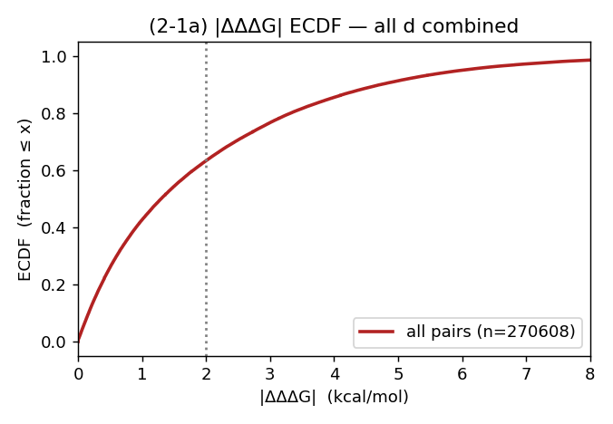
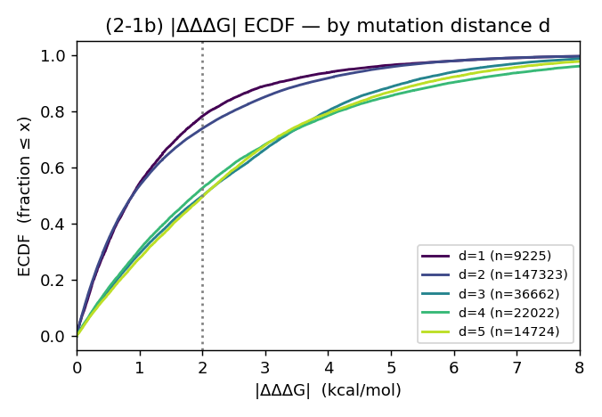
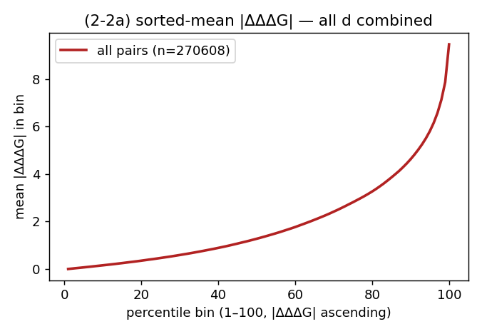
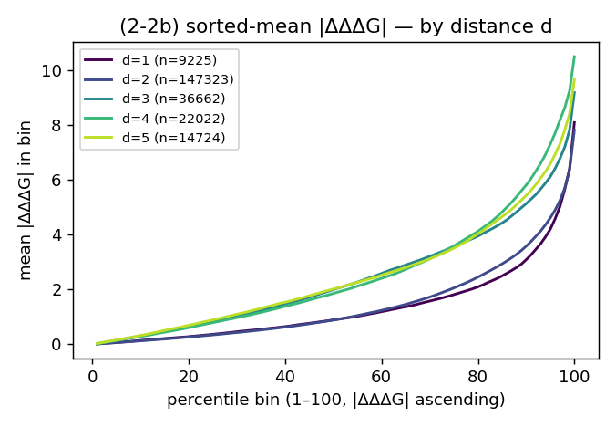
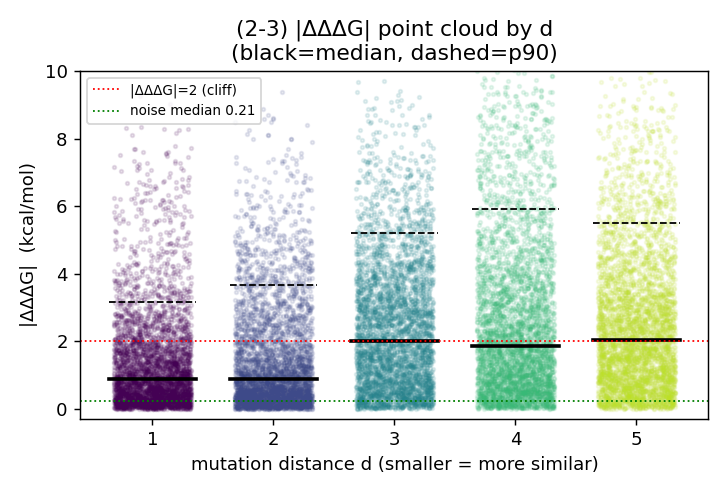
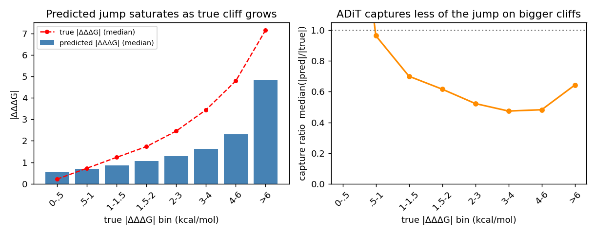

# Mutation Cliff:SKEMPIv2 上的数据分析与 ADiT 失效证据(Research Motivation 草稿)

> 一句话:**在 SKEMPIv2 上,"近乎相同的突变 → ΔΔG 巨变"(mutation cliff)真实且普遍存在,
> 而当前 all-atom ΔΔG 模型(ADiT)在 cliff 上系统性地"抹平"——只预测出约一半的跳变幅度、
> 同位点排序失效。聚合指标(overall Pearson 0.66)完全掩盖了这一失效模式。**

## 1. 背景与定义
化学信息学里的 **activity cliff**:结构高度相似的分子活性却差异巨大,是 QSAR/打分模型的已知失效点。
把它迁移到 **蛋白突变效应(ΔΔG)** 任务:

> **Mutation cliff** = 同一复合物界面上、mutant 序列高度相似(尤其同一位点仅替换氨基酸、或仅差一个突变步)
> 但实验 ΔΔG 差异巨大的一对/一组突变。

## 2. 数据与方法
- 数据:SKEMPIv2,ADiT-S 三折交叉验证的**逐样本池化预测**(`reproduce/skempi_per_sample_pred.csv`,6694 样本)。
- 相似度定义:**突变距离 d** = 两条 mutant 序列不同残基位置数(缺失位点视为 WT)。`d=1` = 差一个突变步
  (同位点换 AA,或加/减一个突变)。
- **cliff 指数 SALI** = `|ΔΔΔG| / d`(每突变步的 ΔΔG 变化,越大越陡)。
- **关键对照——site-matched 噪声基线**:在**同一批 cliff 位点上**,用"同位点·同一个 AA 的重复测量"的 ΔΔG 离散度作噪声基线(而非全数据任意重复),配对对照排除"这些位点本身难测"的替代解释。
- **突变距离 d**(multi-site 用):两条 mutant 序列**逐点比对、取值不同的位点数**(等价 Hamming 距离;只在两者突变位点并集上比即可,其余位点同为 WT)。同位点不同 AA → d=1;不同位点 → d≥2;相同 mutant 已去重故无 d=0。
- **两种 cliff 数值(勿混淆)**:(i) **组级·同位点跨度** = 固定 `(complex, site)`、跨不同 AA 的 ddG `max−min`(§3、图1 用);(ii) **对级·跳变 + SALI** = 任意两 mutant 的 `|ΔΔΔG|` 及 `SALI=|ΔΔΔG|/d`(§4–5 用)。
- **重复测量如何进训练/测试**:SKEMPI 同一突变的多次测量**各作为独立样本保留**(标签=各自原始实验值),**非取 median**;池化口径与 RDE/DiffAffinity/ADiT 一致。实测对 overall 指标无实质影响(去重后 Pearson 0.664 vs 池化 0.662),且 split-by-complex 下重复样本恒在同折、无泄漏。
- 脚本:`mutation_cliff_analysis.py`(单点/同位点)、`mutation_cliff_extended.py`(multi-site/SALI/出图)、`mutation_cliff_viz.py`(§3.1/§4.1/§4.2 的分布图与 ADiT 失效分析,产物在 `mutation_analysis/`)。

## 3. 发现 1:Mutation cliff 真实存在,远超噪声(site-matched 配对对照)
**关键设计**:noise 与 cliff 在**同一批 378 个 `(complex, site)` 位点**上计算,只是 ΔΔG range 的范围不同——
cliff = 同位点跨**不同替换 AA**;noise = 同位点**同一个 AA、跨不同次实验记录**(纯测量噪声)。这样排除了
"这些位点本身难测"的替代解释。

| 同一批 cliff 位点上的 ΔΔG range(kcal/mol) | n | median | p90 | >2 占比 |
|---|---|---|---|---|
| **noise**(同位点·同 AA 重测) | 190 | 0.214 | 0.91 | 1.6% |
| **cliff**(同位点·不同 AA) | 378 | **0.909** | 4.06 | **25.4%** |

- cliff 组额外统计:mean **1.58** / **max 12.9**;range **>2 / >3** 的组占比 **25.4% / 14.6%**。
- 注:378 个 cliff 位点中 **190 个**含被重复测量的 AA,可算 site-matched noise(此即 noise 的样本量)。

→ 在**完全相同的位点**上,换一个氨基酸引起的 ΔΔG 跨度(median 0.91、max 12.9)是同一氨基酸重测跨度
(median 0.21)的 **~4.2 倍**,>2 kcal/mol 的比例 **25.4% vs 1.6%**(差约 16×)。**是氨基酸身份在驱动 ΔΔG,
不是测量误差——cliff 真实且常见**(图 `fig_cliff_vs_noise.png`:同位点不同 AA 的 ECDF 右尾远超同 AA 重测噪声)。

## 3.1 Cliff 存在性的分布可视化(SALI 对级证据)
口径:每个 complex 内 distinct mutant 两两配对(大 complex 做 CAP=250 随机采样,seed=0),pool 全部 341 个 complex
共 **270,608 对**;`d`=突变距离,`|ΔΔΔG|`=该对的真值 ddG 差。下面三组图从**分布形状、尾部、与相似度的关系**三个角度
证明 ΔΔG landscape 在相似突变邻域里本质崎岖。(脚本 `mutation_cliff_viz.py`,图存 `mutation_analysis/`。)

### (2-1) |ΔΔΔG| 的 ECDF —— 大跳变占比可观,且高相似(低 d)同样重尾
<table><tr>
<td></td>
<td></td>
</tr></table>

- 全体对:|ΔΔΔG| median **1.30**,但 **36.6%** 的对 >2 kcal/mol(cliff)、p99 **8.36**、max **13.8**——右尾极重。
- 分 d:最相似的 **d=1** 仍有 **21.7%** 的对 >2(ECDF 在 x=2 处只到 ~0.78);**"相似"并不保证 ΔΔG 接近**。

### (2-2) 排序后 100 等量分位的均值曲线 —— 尾部陡升 = 少数极端 cliff 拉高分布
<table><tr>
<td></td>
<td></td>
</tr></table>

- 把 |ΔΔΔG| 从小到大排序、均分 100 桶,取每桶均值:前 ~63 个分位平缓(<2 kcal/mol),**末 ~10 个分位骤升到 5–14**——
  典型重尾,说明 cliff 是真实的**尾部信号**而非整体平移。
- 分 d:各 d 曲线形状一致(都尾部陡升),**cliff 不依赖突变距离**。

### (2-3) 各 d 的 |ΔΔΔG| 点云 —— 固定相似度下分布"双峰式分散"

| d | n | median | 离散系数 CV | p90 | p99 | max | 平滑<0.5 | 悬崖>2 |
|---|---|---|---|---|---|---|---|---|
| 1 | 9,225 | 0.885 | **1.08** | 3.15 | 6.87 | 12.9 | 32.8% | 21.7% |
| 2 | 147,323 | 0.887 | 1.06 | 3.65 | 6.82 | 11.0 | 34.1% | 26.0% |
| 3 | 36,662 | 2.007 | 0.81 | 5.20 | 8.20 | 13.1 | 16.0% | 50.1% |
| 4 | 22,022 | 1.864 | 0.90 | 5.90 | 9.63 | 12.7 | 16.8% | 47.4% |
| 5 | 14,724 | 2.019 | 0.83 | 5.51 | 8.83 | 12.7 | 14.8% | 50.5% |
| **all** | **270,608** | **1.296** | **0.99** | **4.71** | **8.36** | **13.8** | **26.0%** | **36.6%** |

- **固定 d=1(最相似)**:CV **1.08**(>1 = 高度分散);**32.8% 几乎不变(<0.5)却同时 21.7% 跳 >2**——分布是"近 0 一坨 + 重右尾"的**双峰式**,直接坐实"相似突变里 ΔΔG 不集中"。
- **相似度与 |ΔΔΔG| 近乎不相关**:`corr(d,|ΔΔΔG|)` Pearson **0.27** / Spearman **0.30**(很弱);且 d=1→d=2 的 median 几乎不变(0.885→0.887),**突变距离几乎预测不了 ΔΔG 差多少**(非线性/弱相关)。
- **SALI**:**6.3%** 的对 SALI>2(每突变步跳 >2 kcal/mol)、1.5% SALI>3、max 12.9——landscape 局部极陡。

## 4. 发现 2:ADiT 系统性"抹平" cliff
- **预测幅度压缩**:同位点内真值 ΔΔG range median 0.91,模型预测 range 仅 0.67。
- **跳变低估(同位点突变对,7933 对)**:真值跳变 vs 预测跳变 Pearson 0.57 / Spearman 0.50;
  cliff 对(|ΔΔΔG真|>2,1745 对)**模型只预测出 ~0.47 倍幅度**,真实大跳变里仅 **40%** 被判为大跳变(>3 时仅 33%)。
- **SALI cliff(高 SALI>2,占 6.3%)**:模型预测/真值跳变比中位 **0.52**。
- **同位点排序失效(k≥3,133 组)**:组内 Spearman median 0.50、**mean 仅 0.37、21% 为负**。
- 图:`fig_jump_true_vs_pred.png`(大跳变点全落在 y=x 下方)、`fig_jump_saturation.png`(预测跳变随真值跳变增大而饱和)。

## 4.1 ADiT 预测随真值跳变增大而系统恶化(全 SALI 对,270,608 对)
按真值 |ΔΔΔG| 从小到大分桶,看 ADiT 在每个桶里的预测表现(`capture = median(|pred 跳变| / |true 跳变|)`):

| 真值 \|ΔΔΔG\| 桶 | n | 真值中位 | 预测中位 | capture |
|---|---|---|---|---|
| 0–0.5 | 70,281 | 0.22 | 0.54 | 2.73* |
| 0.5–1 | 45,179 | 0.73 | 0.70 | 0.96 |
| 1–1.5 | 31,745 | 1.23 | 0.87 | 0.70 |
| 1.5–2 | 24,362 | 1.73 | 1.07 | 0.62 |
| 2–3 | 36,040 | 2.45 | 1.29 | 0.52 |
| 3–4 | 24,019 | 3.44 | 1.64 | 0.47 |
| 4–6 | 25,737 | 4.78 | 2.31 | 0.48 |
| >6 | 13,245 | 7.15 | 4.85 | 0.64 |

- **越是 cliff,模型越抓不住**:capture 从平滑区(0.5–1 桶)的 ~0.96 单调跌到 3–4 桶的 **0.47**——大跳变只预测出不到一半幅度。
- **预测幅度饱和**:预测中位停在 ~1.3 附近就上不去了(真值已 2.5 / 3.4 / 4.8,预测仅 1.3 / 1.6 / 2.3),与右图 saturation 一致。
- *0–0.5 桶 capture=2.73>1 是分母趋零的假象(真值≈0 时比值被放大),无意义;有意义的趋势是从 ~1 单调下降。最极端 >6 桶虽回升到 0.64,仍漏掉约 **36%** 跳变。
- **结论**:ADiT 误差**不均匀**——平滑区基本准、cliff 区系统性低估,正是"函数偏平滑、与尖锐 landscape 冲突"的直接表现。

## 4.2 全 SALI 对的真值/预测跳变表 + 极端低估 case
- **完整表**(270,608 对):`mutation_analysis/sali_pairs_table.csv`,列 = `PDB, site(差异位点), d, ddG_A, ddG_B, true_jump, pred_jump, absT, absP, pred_over_true`,已按 **`PDB → d↑ → pred_over_true↑`** 排序。
- **Top 极端 cliff 低估 case(真值跳变 >4 kcal/mol,模型预测跳变 ≈0):**

| PDB | 差异位点 | d | ddG_A | ddG_B | 真值跳变 | 预测跳变 | pred/true |
|---|---|---|---|---|---|---|---|
| 1CHO_EFG_I | I12,I18 | 2 | 3.52 | −1.93 | 5.45 | 0.00 | 0.00 |
| 1JTG_A_B | A217,A82,B50,B74 | 4 | 6.62 | −0.65 | 7.27 | 0.00 | 0.00 |
| 3S9D_A_B | A19,A23,B35 | 3 | 1.11 | 7.11 | 6.01 | 0.00 | 0.00 |
| 1JTG_A_B | A85,B113,B163,B165,B89 | 5 | 4.57 | −2.39 | 6.96 | 0.00 | 0.00 |
| 2JEL_LH_P | P2,P3 | 2 | 0.00 | 4.09 | 4.09 | 0.00 | 0.00 |
| 1R0R_E_I | I10,I27,I31 | 3 | 5.90 | 0.29 | 5.62 | 0.01 | 0.00 |

- **现象**:这些对里两个 mutant 真值 ddG 一正一负(相差 5–7 kcal/mol),**ADiT 却预测出接近 0 的跳变**——把天差地别的两个突变判成几乎等同。
- **集中在蛋白酶-抑制剂界面**(1CHO / 1R0R / 1JTG / 2JEL),与 §6 同位点极端 case 同源。
- **结论**:cliff 低估**不是个别噪声点,而是横跨多界面、多种 d 的系统现象**。

## 5. 发现 3:single 与 multi-site 近邻都存在 cliff(d=1 细分)
| d=1 子类 | 对数 | \|ΔΔΔG真\| 中位 | p90 | 真>2 占比 | 预测/真值比 |
|---|---|---|---|---|---|
| single 同位点换 AA | 7106 | 0.90 | 3.20 | 21.8% | 0.79 |
| multi 近邻(加/减一个突变) | 2119 | 0.81 | 3.03 | 21.4% | 0.71 |

→ cliff 不是单点突变独有;**多突变背景下"差一个突变步"同样出现大跳变,且模型低估更重**。
(图 `fig_absT_by_distance.png`:即使 d=1,\|ΔΔΔG\| 的大跳变依然存在。)

## 6. 极端实例(同位点、模型几乎完全抹平)
| 界面 | 位点 | A vs B | ddG_A / ddG_B | 真值跳变 | 模型预测跳变 |
|---|---|---|---|---|---|
| 1CHO_EFG_I | I15 | E vs W | +6.76 / −1.69 | **8.45** | **0.34** |
| 1PPF_E_I | I18 | R vs V | +7.18 / −0.49 | 7.68 | −0.31 |
| 1R0R_E_I | I10 | D vs I | +5.23 / −1.80 | 7.03 | −0.07 |
| 2JEL_LH_P | P34 | N vs Q | +6.82 / 0.00 | 6.82 | −0.17 |

这些多是**蛋白酶-抑制剂的 P1 关键位点**(1CHO/1PPF/1R0R 的 I15/I18/I10):同一位点不同替换效应天差地别,模型却预测几乎相同。

## 7. 机制假说(可攻的研究点)
单残基替换下**模型输入几乎不变**(共享 WT 主链结构,仅一个残基的原子/ESM 嵌入变化)→ 表征近乎不变 →
输出近乎恒定 → **cliff 被抹平**。即:**当前 all-atom ΔΔG 模型在函数上偏"平滑",与 ΔΔG landscape 的"尖锐性"本质冲突。**
(注:mt 结构由 FoldX 在固定主链上建模,可能进一步削弱模型对单点替换的敏感度——结构 vs 序列表征对 cliff 的贡献本身值得拆解。)

## 8. 研究方向(motivation 落点)
1. **cliff-aware 表征/损失**:放大单残基替换的表征差异(如 substitution-specific embedding、对比学习把 cliff 对推开),或在损失里加权 cliff 对。
2. **不确定性 / 拒识**:在 cliff 邻域输出高不确定性,而非自信地给平滑值。
3. **评测改革**:把 **per-interface 排序 + cliff 子集指标 + SALI** 纳入标准评测,避免 overall 指标掩盖失效。
4. **序列 vs 结构归因**:量化 FoldX 建模结构对单点敏感度的限制。

## 9. 诚实的局限
- 基于**单次训练**(三折池化、单 seed);严谨需多 seed/多模型,并验证 baselines 是否同样平滑(很可能是普遍现象)。
- ΔΔG 有测量噪声;已用 **site-matched 噪声**(同位点·同 AA 重测,median ~0.21、p90 ~0.9)对照,cliff 信号(>2–3)远超之,但个别大跳变可能含噪声/不同实验条件。
- 大界面配对做了 CAP=250 采样以控规模;同位点深扫组数有限(378 组、k≥3 仅 133 组)。

## 10. 产物
- 数据:`skempi_per_sample_pred.csv`、`skempi_mutation_cliff_pairs.csv`(同位点对)、`skempi_same_site_groups.csv`、
  `skempi_cliff_pairs_SALI_top2000.csv`(按 SALI 排序);**全 SALI 对表 `mutation_analysis/sali_pairs_table.csv`(270,608 行)**。
- 图(根目录):`fig_cliff_vs_noise.png`、`fig_jump_true_vs_pred.png`、`fig_jump_saturation.png`、`fig_absT_by_distance.png`。
- 图(`mutation_analysis/`):`ecdf_dddg_combined.png` / `ecdf_dddg_by_d.png`(2-1)、`qmean_dddg_combined.png` / `qmean_dddg_by_d.png`(2-2)、`pointcloud_dddg_by_d.png`(2-3)、`adit_error_by_dddg_bin.png`(3-1)。
- 脚本:`mutation_cliff_analysis.py`、`mutation_cliff_extended.py`、`mutation_cliff_viz.py`。
