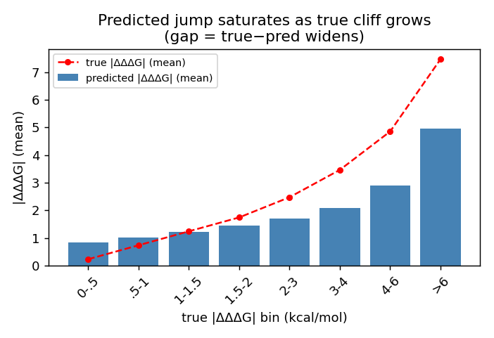
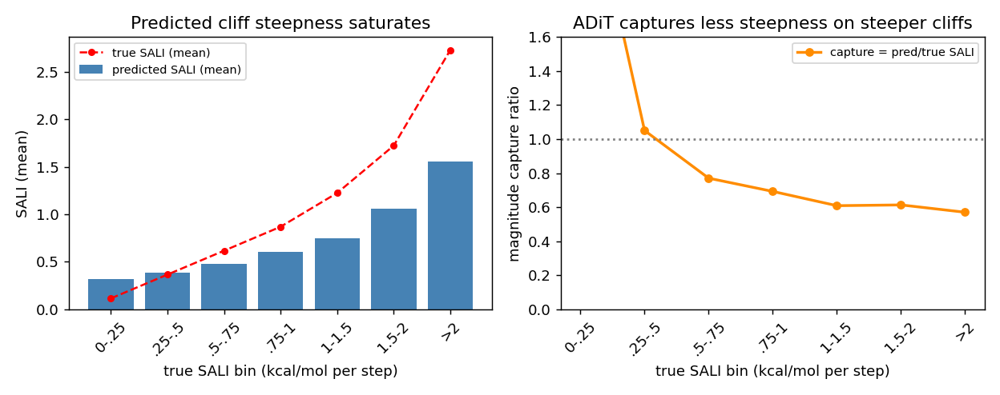

# Mutation Cliff:SKEMPIv2 上的数据分析与 ADiT 失效证据(Research Motivation 草稿)

> 一句话:**在 SKEMPIv2 上,"近乎相同的突变 → ΔΔG 巨变"(mutation cliff)真实且普遍存在**(以 cliff 指数
> `SALI = |ΔΔΔG|/d` 度量:**6.3% 的突变对每突变步跳变 >2 kcal/mol**);**而 ADiT 在 cliff 上系统性"抹平"——
> 跳变/陡峭度幅度只预测出约 60%(capture 随 cliff 加剧从 ~1 跌到 0.57),极端 cliff 上甚至预测反向**。
> 聚合指标(overall Pearson 0.66)完全掩盖了这一失效模式。

## 1. 背景与定义
化学信息学里的 **activity cliff**:结构高度相似的分子活性却差异巨大,是 QSAR/打分模型的已知失效点。
迁移到 **蛋白突变效应(ΔΔG)** 任务:

> **Mutation cliff** = 同一复合物界面上、mutant 序列高度相似(尤其同一位点仅替换氨基酸、或仅差一个突变步)
> 但实验 ΔΔG 差异巨大的一对/一组突变。

## 2. 数据与方法
- 数据:SKEMPIv2,ADiT-S 三折交叉验证的**逐样本池化预测**(`reproduce/skempi_per_sample_pred.csv`,6694 样本)。
- **突变距离 d**:两条 mutant 序列**逐点比对、取值不同的位点数**(等价 Hamming 距离;只在两者突变位点并集上比即可,
  其余位点同为 WT)。同位点不同 AA → d=1;不同位点 → d≥2;相同 mutant 已去重故无 d=0。
- **cliff 指数 SALI** = `|ΔΔΔG| / d`(每突变步引起的 ΔΔG 变化,越大越陡)。**这是刻画 cliff 的核心指标**:
  big ΔΔG 若跨很多突变步(大 d)不稀奇,跨一步(小 d)才是"悬崖"。
- **配对集合(§3 SALI、§4 跳变分析共用)**:每个 complex 内 distinct mutant(同突变集合的重复测量先取均值)
  两两任意配对(distinct mutant >250 的大 complex 做 **CAP=250 随机采样**,seed=0),pool 全部 341 个 complex
  共 **270,608 对**。
- **site-matched 噪声基线(§3)**:在同一批 cliff 位点上,用"同位点·同一个 AA 的重复测量"的 ΔΔG 离散度作噪声基线
  (而非全数据任意重复),排除"这些位点本身难测"的替代解释。
- **重复测量如何进训练/测试**:SKEMPI 同一突变的多次测量**各作为独立样本保留**(标签=各自原始实验值),**非取 median**;
  池化口径与 RDE/DiffAffinity/ADiT 一致;实测对 overall 指标无实质影响(去重后 Pearson 0.664 vs 池化 0.662)、且
  split-by-complex 下重复样本恒在同折、无泄漏。
- 脚本:`mutation_cliff_analysis.py`(单点/同位点)、`mutation_cliff_extended.py`(配对/SALI 基础版)、
  `mutation_cliff_viz.py`(§3/§4 的分布图与 ADiT 失效分析,产物在 `mutation_analysis/`)。

## 3. 发现 1:Mutation cliff 真实存在
### 3a. site-matched 配对对照(同位点跨 AA vs 同 AA 重测)
noise 与 cliff 在**同一批 378 个 `(complex, site)` 位点**上算,只是 ΔΔG range 的范围不同:cliff = 同位点跨**不同替换 AA**;
noise = 同位点**同一个 AA、跨不同次实验记录**(纯测量噪声)。

| 同一批 cliff 位点上的 ΔΔG range(kcal/mol) | n | median | p90 | >2 占比 |
|---|---|---|---|---|
| **noise**(同位点·同 AA 重测) | 190 | 0.214 | 0.91 | 1.6% |
| **cliff**(同位点·不同 AA) | 378 | **0.909** | 4.06 | **25.4%** |

→ 完全相同的位点,换一个氨基酸引起的 ΔΔG 跨度(median 0.91、max 12.9)是同一氨基酸重测跨度(median 0.21)的
**~4.2 倍**,>2 占比 **25.4% vs 1.6%**(差约 16×)。**是氨基酸身份在驱动 ΔΔG,不是测量误差**(图 `fig_cliff_vs_noise.png`)。

### 3b. 用 cliff 指数 SALI 的三组证据
对全部 270,608 个突变对,从分布形状、尾部、与相似度的关系三个角度看 SALI = |ΔΔΔG|/d。

**Evidence 1 — SALI 的 ECDF:每突变步的大跳变占比可观,且最相似(d=1)处最陡**
<table><tr>
<td></td>
<td></td>
</tr></table>

- 全体对:SALI median 0.44,但 **6.3% 的对 SALI>2**(每突变步跳 >2 kcal/mol)、p99 **3.29**、max **12.9**——重尾。
- 分 d:**d=1 的尾部最重**(SALI>2 占 **21.7%**,ECDF 在 x=2 处只到 ~0.78);**单步替换正是最陡的悬崖**。

**Evidence 2 — 排序后 100 等量分位的均值曲线:cliff 是尾部事件**
<table><tr>
<td></td>
<td></td>
</tr></table>

- 把 SALI 从小到大排序、均分 100 桶取均值:前 ~90 个分位平缓(<1.6),**末 ~6 个分位骤升到 3–13**——
  典型重尾,**陡峭 cliff 是少数尾部事件而非整体平移**。
- 分 d:d=1 曲线整体最高(单步最陡),高 d 因除以大 d 而整体下移。

**Evidence 3 — 各 d 的 SALI 点云 + 统计**

| d | n | median | 离散系数 CV | p90 | p99 | max | 平滑<0.5 | 悬崖>2 |
|---|---|---|---|---|---|---|---|---|
| 1 | 9,225 | **0.885** | **1.08** | 3.15 | 6.87 | 12.9 | 32.8% | **21.7%** |
| 2 | 147,323 | 0.444 | 1.06 | 1.82 | 3.41 | 5.52 | 53.6% | 8.1% |
| 3 | 36,662 | 0.669 | 0.81 | 1.73 | 2.74 | 4.38 | 40.4% | 5.9% |
| 4 | 22,022 | 0.466 | 0.90 | 1.47 | 2.41 | 3.19 | 52.6% | 3.9% |
| 5 | 14,724 | 0.404 | 0.83 | 1.10 | 1.77 | 2.54 | 59.4% | 0.2% |
| **all** | **270,608** | **0.440** | **1.07** | **1.65** | **3.29** | **12.9** | **54.2%** | **6.3%** |

- **最相似(d=1)处 SALI 最高**:median 0.885、**21.7% 的对每步跳 >2**——相似度越高,单步悬崖越突出。
- **固定 d 内 SALI 高度分散**:各 d 的 CV ≈ 0.8–1.08(>0.8),**相似突变里 SALI 既有近 0、又有 >2 的尾部**,分布不集中。
- **相似度与 SALI 弱(负)相关**:`corr(d, SALI)` Pearson **−0.21** / Spearman **−0.13**——距离越大 SALI 越小(被 d 归一),
  但**单步(d=1)反而最陡**,印证 cliff 集中在"最相似"邻域。

## 4. 发现 2:ADiT 系统性"抹平" cliff(只看 ddG / |ΔΔΔG|)
- **预测幅度压缩**:同位点内真值 ΔΔG range median 0.91,模型预测 range 仅 0.67。
- **跳变低估(同位点突变对,7933 对)**:真值跳变 vs 预测跳变 Pearson 0.57 / Spearman 0.50;cliff 对(|ΔΔΔG真|>2,
  1745 对)模型只预测出 ~0.47 倍幅度,真实大跳变里仅 40% 被判为大跳变(>3 时仅 33%)。
- **同位点排序失效(k≥3,133 组)**:组内 Spearman median 0.50、**mean 仅 0.37、21% 为负**。

### 4.1 ADiT 在 cliff 上的两类失效:幅度饱和 + 幅度 capture 下降
**(i) 按真值 |ΔΔΔG| 分桶,mean 真值 vs mean 预测 —— 预测幅度"饱和"**

| 真值 \|ΔΔΔG\| 桶 | n | 真值 mean | 预测 mean | gap=真值−预测 |
|---|---|---|---|---|
| 0–0.5 | 70,281 | 0.23 | 0.82 | −0.60 |
| 0.5–1 | 45,179 | 0.73 | 1.02 | −0.28 |
| 1–1.5 | 31,745 | 1.24 | 1.21 | +0.03 |
| 1.5–2 | 24,362 | 1.74 | 1.45 | +0.29 |
| 2–3 | 36,040 | 2.47 | 1.71 | +0.76 |
| 3–4 | 24,019 | 3.46 | 2.07 | +1.39 |
| 4–6 | 25,737 | 4.85 | 2.88 | +1.97 |
| >6 | 13,245 | 7.47 | 4.95 | **+2.52** |

- **小跳变 over-predict、大跳变 under-predict**:预测 mean 像被"钉"在 ~0.8–2 的区间——真值 0.2 时预测 0.8(偏大),
  真值 7.5 时预测仅 4.9(偏小)。这是**回归到均值式的平滑**,gap 随真值跳变单调拉大到 +2.5。

**(ii) 按 cliff 指数 SALI 分桶 —— 越陡的 cliff,模型 capture 的陡峭度越少**

| 真值 SALI 桶 | n | 真值 SALI mean | 预测 SALI mean | **capture=预测/真值** | Pearson† | Spearman† |
|---|---|---|---|---|---|---|
| 0–.25 | 90,454 | 0.12 | 0.32 | 2.75* | 0.21 | 0.14 |
| .25–.5 | 56,246 | 0.37 | 0.38 | 1.05 | 0.48 | 0.39 |
| .5–.75 | 36,386 | 0.62 | 0.48 | 0.77 | 0.61 | 0.55 |
| .75–1 | 24,265 | 0.87 | 0.60 | 0.69 | 0.70 | 0.66 |
| 1–1.5 | 30,467 | 1.23 | 0.75 | 0.61 | 0.70 | 0.69 |
| 1.5–2 | 15,801 | 1.72 | 1.06 | 0.61 | 0.77 | 0.76 |
| **>2** | 16,989 | 2.73 | 1.56 | **0.57** | 0.82 | 0.82 |

- **capture 单调下降**:从 ~1(.25–.5 桶)跌到最陡 cliff(SALI>2)的 **0.57**——**cliff 越陡,模型越只预测出其一小部分陡峭度**。
  这正是"模型在 cliff 上退化"的本质:**幅度压缩**。
- *0–.25 桶 capture=2.75>1 是分母趋零的假象(真值≈0 时比值放大),无意义。
- †**Pearson/Spearman(signed 跳变)反而随 cliff 上升**(0.21→0.82):这是**动态范围/SNR 的内禀效应**(大 cliff 桶里跳变
  动态范围大、信噪比高),说明**方向/排序被保住**——模型"知道往哪边变、谁更大",**但严重低估变化幅度**。即:cliff 失效
  在**幅度**而非方向。

### 4.2 全配对的真值/预测跳变表 + 极端失配 case
- **完整表**(270,608 对):`mutation_analysis/sali_pairs_table.csv`,列 = `PDB, site(差异位点), d, ddG_A, ddG_B,
  true_jump, pred_jump, diff_percent`,其中 **`diff_percent = (pred_jump − true_jump) / true_jump`**(预测跳变相对真值
  跳变多/少多少);已按 **`PDB → d↑ → |diff_percent|↓`** 排序。
- **Top 极端失配 case(真值跳变 >4 kcal/mol,模型严重失配,按 diff_percent 最负):**

| PDB | 差异位点 | d | ddG_A | ddG_B | 真值跳变 | 预测跳变 | diff_percent |
|---|---|---|---|---|---|---|---|
| 1PPF_E_I | I18,I32 | 2 | 6.64 | 2.52 | +4.11 | **−7.46** | −282% |
| 1R0R_E_I | I10,I13,I16,I18,I27 | 5 | 5.90 | 1.89 | +4.01 | **−6.04** | −250% |
| 1PPF_E_I | I10,I17,I18,I19,I21,… | 9 | 7.54 | 3.28 | +4.26 | **−6.40** | −250% |
| 1PPF_E_I | I18 | 1 | 3.33 | 7.54 | −4.21 | **+5.81** | −238% |
| 1R0R_E_I | I10,I12,…,I43,I5 | 10 | 1.78 | 5.90 | −4.13 | **+5.48** | −233% |
| 1CHO_EFG_I | I12,I14,…,I46,I7 | 11 | −0.03 | 4.23 | −4.26 | **+5.53** | −230% |

- **现象**:这些对的真值跳变 4–5 kcal/mol,**ADiT 不仅低估,反而预测出方向相反、幅度相当的跳变**(diff_percent ≈ −230~−282%)。
- **集中在蛋白酶-抑制剂界面**(1PPF / 1R0R / 1CHO 的 P1 附近热点位点);与 §3a 的同位点极端 cliff 同源。
- **结论**:与 §4.1 互补——平均看模型"方向多半对、幅度压缩",但在**最陡的极端 cliff 上会彻底失配(预测反向)**;
  cliff 失效**横跨多界面、多种 d,是系统现象**。

## 5. 产物
- 数据:`skempi_per_sample_pred.csv`、`skempi_mutation_cliff_pairs.csv`、`skempi_same_site_groups.csv`、
  `skempi_cliff_pairs_SALI_top2000.csv`;**全配对表 `mutation_analysis/sali_pairs_table.csv`(270,608 行)**。
- 图(根目录):`fig_cliff_vs_noise.png`(§3a)、`fig_jump_true_vs_pred.png`、`fig_jump_saturation.png`、`fig_absT_by_distance.png`。
- 图(`mutation_analysis/`):`ecdf_sali_combined.png`/`ecdf_sali_by_d.png`(Evidence 1)、`qmean_sali_combined.png`/`qmean_sali_by_d.png`(Evidence 2)、`pointcloud_sali_by_d.png`(Evidence 3)、`adit_jump_saturation.png`(§4.1-i)、`adit_sali_degradation.png`(§4.1-ii)。
- 脚本:`mutation_cliff_analysis.py`、`mutation_cliff_extended.py`、`mutation_cliff_viz.py`。
